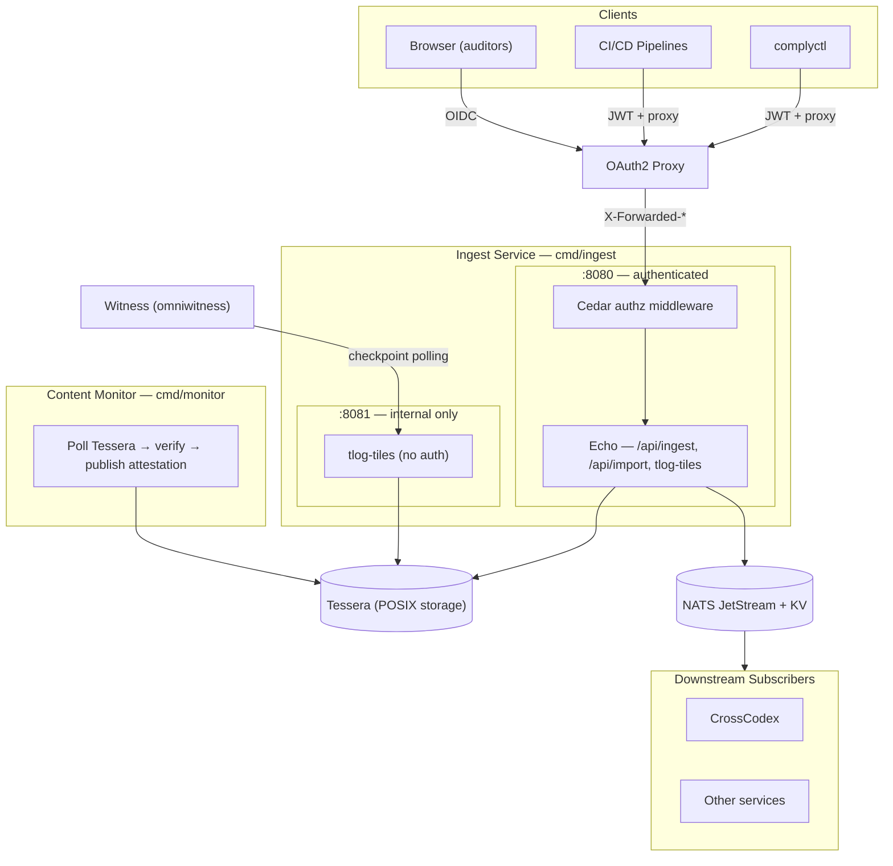
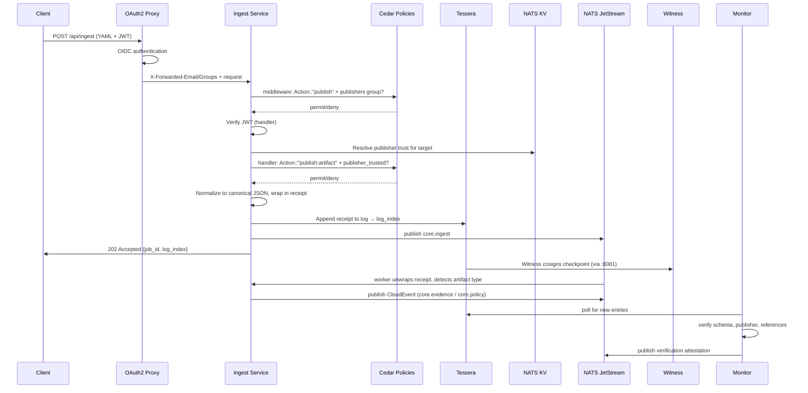

<!-- SPDX-License-Identifier: Apache-2.0 -->

# ComplyTime Ingest Architecture

Compliance evidence ingestion and transparency service. Accepts Gemara artifacts via JWT-authenticated API, appends to a Tessera transparency log, publishes CloudEvents to NATS. No PostgreSQL. All query and analysis capabilities are in downstream services (CrossCodex).

## System Overview

| Boundary | Role | Tech | Repository |
|:--|:--|:--|:--|
| **Ingest Service** | Evidence ingestion, Tessera log, publisher trust, tlog-tiles API | Go (Echo), Tessera (embedded), NATS JetStream + KV | [complytime-core](https://github.com/complytime-labs/complytime-core) |
| **Content Monitor** | Independent verification: schema, publisher trust, reference integrity | Go (standalone binary), Tessera (read) | [complytime-core](https://github.com/complytime-labs/complytime-core) |
| **CrossCodex** | Query and analysis: evidence queries, coverage, policy management, graph | TBD | [crosscodex](https://github.com/complytime-labs/crosscodex) |

**Upstream tools** (produce artifacts consumed by ingest):

| Tool | Role | Repository |
|:--|:--|:--|
| **complyctl** | CLI: pulls policies from OCI, scans targets, produces Gemara EvaluationLogs | [complyctl](https://github.com/complytime/complyctl) |
| **complypack** | Policy authoring: validate, test, package assessment logic as signed OCI artifacts | [complytime/issues/8](https://github.com/complytime/complytime/issues/8) |



## Binaries

### Ingest Service (`cmd/ingest`)

Accepts Gemara artifacts, appends to Tessera, publishes NATS events. Serves the tlog-tiles read API for offline verification.

| Concern | Implementation |
|:--|:--|
| HTTP | Echo — two listeners (:8080 authenticated, :8081 internal) |
| Authorization | Cedar policies — default-deny middleware with forbid safety floors |
| Transparency | Tessera — embedded Go library, POSIX storage, cosigned checkpoints |
| Publisher trust | NATS KV bucket `publisher-trust` + Cedar `publish:artifact` evaluation |
| Target registry | NATS KV bucket `targets-registry` |
| Events | NATS JetStream — async ingest worker, evidence/policy/target events |
| Auth | OAuth2 Proxy `X-Forwarded-*` headers + JWT bearer (OIDC JWKS) for publish |
| tlog-tiles (:8080) | `/checkpoint`, `/tile/*`, `/log/witnessed/:index` — authenticated, Cedar-gated |
| tlog-tiles (:8081) | Same endpoints — unauthenticated, network-isolated for witness |

**Hard requirements:** `NATS_URL` must be set and reachable.

### Content Monitor (`cmd/monitor`)

Independent verification daemon that polls Tessera and validates evidence quality.

| Concern | Implementation |
|:--|:--|
| Verification | Schema validation (implemented). Publisher trust, reference integrity, and target registration checks are planned but not yet wired (#128). |
| Config | YAML file with trusted publisher patterns and poll interval |
| State | JSON file persisting last verified index across restarts |

**Hard requirements:** `TESSERA_PATH` must be set.

## Authentication and Authorization

| Layer | Mechanism |
|:--|:--|
| **Authentication** | OAuth2 Proxy sidecar handles OIDC, sets `X-Forwarded-Email/User/Groups` headers. All routes on :8080 except `/healthz` and `/auth/*` require `X-Forwarded-Email`. |
| **JWT Bearer** | `POST /api/ingest` additionally accepts OIDC JWT tokens verified via JWKS discovery. For CI/CD pipelines and scanning tools. |
| **Cedar middleware** | Default-deny. Every authenticated request is evaluated against Cedar policies. Unmapped routes return 403. |
| **Cedar publish gate** | `POST /api/ingest` and `POST /api/import` require `publishers` group membership (Cedar `Action::"publish"`). |
| **Cedar target trust** | Ingest handler evaluates `publish:artifact` with per-target publisher trust for all artifact types. |
| **Cedar admin** | Admin API evaluates `admin:register-target` requiring `admins` group membership. |
| **Forbid safety floors** | Embedded `forbid/unless` rules for `read:entries` (auditors), `publish` (publishers), `publish:artifact` (target trust), and `admin:register-target` (admins) cannot be overridden by directory policies. |
| **Internal listener** | `:8081` serves tlog-tiles without auth for witness. Network-isolated by default (127.0.0.1). |

## Receipt Model

Non-DSSE submissions are normalized to canonical JSON and wrapped in an [in-toto v1 Statement](https://github.com/in-toto/attestation/tree/main/spec/v1) with predicate type `https://complytime.dev/gemara-receipt/v1`. The receipt durably binds channel identity to content in the transparency log.

| Field | Description |
|:--|:--|
| `content` | Inline canonical JSON (Gemara artifact) |
| `contentDigest` | SHA-256 of the canonical form |
| `publisher` | Channel identity from verified JWT (issuer, subject, method) |
| `authorType` | Self-declared provenance claim from `metadata.author.type` |
| `artifactType` | Gemara artifact type from `metadata.type` |

DSSE-signed envelopes (`Content-Type: application/vnd.dsse+json`) are stored as-is using the [DSSE](https://github.com/secure-systems-lab/dsse) envelope format. The producer's signing identity is in the envelope. Signature verification is a consumer-edge concern.

Size limit: 256 KiB per submission. Gemara artifacts are structured summaries, not raw evidence.

## Data Flow



## Key Routes

### Primary listener (:8080, authenticated + Cedar)

| Method | Path | Cedar Action | Access |
|:--|:--|:--|:--|
| GET | `/healthz` | (exempt) | Unauthenticated |
| GET | `/auth/me` | (exempt) | Unauthenticated |
| GET | `/auth/logged-out` | (exempt) | Unauthenticated |
| GET | `/checkpoint` | `read:checkpoint` | Any authenticated |
| GET | `/tile/*` | `read:entries` | Auditors group |
| GET | `/log/witnessed/:index` | `read:checkpoint` | Any authenticated |
| GET | `/api/config` | `read:status` | Any authenticated |
| GET | `/api/system-info` | `read:status` | Any authenticated |
| GET | `/api/ingest/jobs/:job_id` | `read:status` | Any authenticated |
| POST | `/api/ingest` | `publish` | Publishers group + target trust |
| POST | `/api/import` | `publish` | Publishers group |
| POST | `/api/admin/targets` | `admin:register-target` | Admins group |

### Internal listener (:8081, network-isolated)

| Method | Path | Access |
|:--|:--|:--|
| GET | `/healthz` | Unauthenticated |
| GET | `/checkpoint` | Unauthenticated (witness) |
| GET | `/tile/*` | Unauthenticated (witness) |
| GET | `/log/witnessed/:index` | Unauthenticated (witness) |

## NATS Subjects

| Subject | CloudEvents type | Use |
|:--|:--|:--|
| `core.ingest` | (internal, not CloudEvents) | Async ingest worker (JetStream durable consumer) |
| `core.evidence.<policy_id>` | `dev.complytime.evidence.ingested` | Evidence ingested for a policy |
| `core.policy.new` | `dev.complytime.policy.imported` | New Policy artifact ingested |
| `core.target.registered` | `dev.complytime.target.registered` | Target registered via admin API |
| `core.draft.<policy_id>` | `dev.complytime.auditlog.drafted` | Draft audit log created |

All public events use [CloudEvents v1.0](https://cloudevents.io) structured-mode JSON envelopes. The `subject` attribute is the target ID. Source is configurable via `CLOUDEVENTS_SOURCE` (default: `https://complytime.dev/core`).

## NATS KV Buckets

| Bucket | Key | Value | Purpose |
|:--|:--|:--|:--|
| `publisher-trust` | `targets.<target_id>` | JSON array of publisher allowlist entries | Authorization at ingest boundary |
| `targets-registry` | `<target_id>` | JSON target registration | Target metadata |

Both are materialized views of TargetRegistration entries in Tessera. Rebuildable from the log on bucket loss.

## Configuration

| Variable | Required | Purpose |
|:--|:--|:--|
| `NATS_URL` | Yes | Event bus and KV store |
| `TESSERA_PATH` | No | Transparency log directory (default: `/data/tessera`) |
| `TESSERA_SIGNER_KEY_PATH` | No | Persistent signer key |
| `TESSERA_CHECKPOINT_INTERVAL` | No | Checkpoint publish interval (default: 10m) |
| `TESSERA_WITNESS_POLICY_PATH` | No | Sigsum witness policy file |
| `TESSERA_WITNESS_TIMEOUT` | No | Max wait for cosignatures (default: 5s) |
| `TESSERA_WITNESS_FAIL_OPEN` | No | Fail-closed by default (default: false) |
| `JWT_ISSUERS` | No | Comma-separated allowed JWT issuers |
| `JWT_AUDIENCE` | No | Expected JWT audience claim |
| `PORT` | No | Listen port (default: 8080) |
| `INTERNAL_PORT` | No | Internal listener port (default: 8081) |
| `INTERNAL_LISTEN_HOST` | No | Internal listener bind address (default: 127.0.0.1) |
| `CEDAR_POLICY_DIR` | No | Directory with additional `.cedar` policy files (merged with embedded defaults) |
| `CEDAR_POLL_INTERVAL` | No | Policy directory poll interval (default: 30s) |
| `CLOUDEVENTS_SOURCE` | No | CloudEvents source URI (default: `https://complytime.dev/core`) |
| `CORS_ORIGINS` | No | Comma-separated allowed origins |

## Removed Query Endpoints (moved to CrossCodex)

The following endpoints were removed in ADR 0044. CrossCodex or other downstream subscribers should implement these as NATS subscribers with their own read models:

| Endpoint | Purpose | NATS subject to subscribe |
|:--|:--|:--|
| `GET /api/evidence` | Query evidence by target, policy, date | `core.evidence.>` |
| `GET /api/policies`, `GET /api/policies/{id}` | Policy CRUD | `core.policy.new` |
| `GET /api/policies/discover` | Dimension-based policy discovery | `core.policy.new` |
| `GET /api/targets` | List registered targets | `core.target.registered` |
| `GET /api/catalogs` | List catalogs | `core.ingest` (filter by type) |
| `GET /api/requirements` | Requirements matrix | Derived from policies + evidence |
| `GET /api/posture` | Posture aggregates | Derived from evidence + trust signals |
| `GET /api/audit-logs`, `POST /api/audit-logs` | Audit log CRUD | `core.ingest` (filter AuditLog) |
| `GET /api/draft-audit-logs` | Draft audit logs | `core.ingest` (filter by type) |
| `POST /api/audit-logs/promote` | Promote draft to official | Was Postgres-only |
| `GET /api/mappings` | Framework mappings | `core.ingest` (filter MappingDocument) |
| `GET /api/threats`, `GET /api/risks` | Threat/risk catalogs | `core.ingest` (filter by type) |
| `GET /api/inventory` | Evidence inventory | Derived from evidence |
| `GET /api/users/*` | User management | Removed (no role-based access) |
| `GET /api/role-changes/*` | Role change history | Removed (no role-based access) |
| `GET /api/certifications` | Certification results | Monitor publishes to NATS |

## Testing

```bash
# Unit tests
go test -tags dev ./...

# Smoke test (requires docker compose stack)
./scripts/setup-witness.sh
cd deploy/compose && docker compose -f docker-compose.yaml -f docker-compose.testjwks.yml up --build -d
cd ../.. && ./scripts/smoke-test.sh

# Integration tests (Ginkgo, in-process Tessera)
go test -tags integration ./internal/e2e/ -run "Transparency"
```

## Related Docs

| Doc | Topic |
|:--|:--|
| [ADRs](decisions/) | Architecture decisions |
| [ADR 0044: Remove PostgreSQL](decisions/remove-postgresql.md) | Why and how Postgres was removed |
| [ADR 0045: Testing Strategy](decisions/testing-strategy.md) | Five test layers |
| [API spec](api/openapi.yaml) | OpenAPI 3.1 definition |
