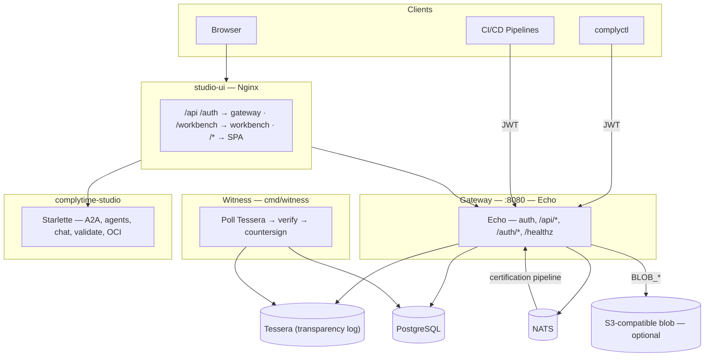
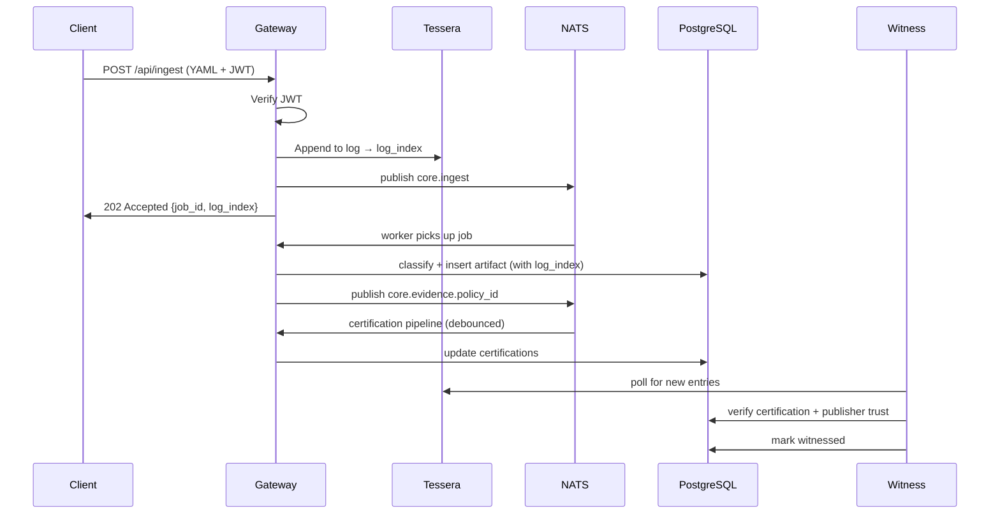

<!-- SPDX-License-Identifier: Apache-2.0 -->

# ComplyTime Core Architecture

The data platform API for the ComplyTime ecosystem. Stores and serves compliance evidence, policies, catalogs, and audit artifacts. All evidence is appended to a Tessera transparency log for immutability. An independent witness service verifies entries. Other services consume the API via REST or MCP.

## System Overview

ComplyTime spans multiple repositories. This repo owns the gateway, witness, and data layer.

| Boundary | Role | Tech | Repository |
|:--|:--|:--|:--|
| **Data Platform** | Headless API: evidence ingestion, Tessera log, certifier pipeline, policy enrollment, auth | Go (Echo), PostgreSQL, NATS, Tessera | [complytime-core](https://github.com/complytime-labs/complytime-core) |
| **Witness** | Independent verification daemon: certification, publisher trust, reference integrity | Go (standalone binary) | [complytime-core](https://github.com/complytime-labs/complytime-core) |
| **Studio Workbench** | Agent support: A2A routing, chat, Gemara validation, OCI ops | Python (Starlette), LangGraph | [complytime-studio](https://github.com/complytime-labs/complytime-studio) |
| **Studio UI** | Analyst dashboard: posture, evidence, audit views | Preact SPA, Nginx | [studio-ui](https://github.com/complytime-labs/studio-ui) |
| **Studio Deploy** | Helm chart for Kind/Kubernetes deployment | Helm | [studio-deploy](https://github.com/complytime-labs/studio-deploy) |

**Upstream tools** (produce artifacts consumed by core):

| Tool | Role | Repository |
|:--|:--|:--|
| **complyctl** | CLI: pulls policies from OCI, scans targets, produces Gemara EvaluationLogs | [complyctl](https://github.com/complytime/complyctl) |
| **complypack** | Policy authoring: validate, test, package assessment logic as signed OCI artifacts | [complytime/issues/8](https://github.com/complytime/complytime/issues/8) |
| **CrossCodex** | Compliance crosswalking: LLM-verified framework requirement mapping | [crosscodex](https://github.com/complytime-labs/crosscodex) |



## Binaries

### Gateway (`cmd/gateway`)

Echo serves `/api/*`, `/auth/*`, and `/healthz` on a single port (default 8080).

| Concern | Implementation |
|:--|:--|
| HTTP | Echo — single listener, middleware stack |
| Data | `internal/store` + `internal/postgres` — single pool, `EnsureSchema` at startup |
| Events | `internal/events` — NATS; debounced certification pipeline on evidence subjects |
| Transparency | `internal/tessera` — Tessera append-only log; every ingest gets a `log_index` |
| Blobs | `internal/blob` — MinIO-compatible when `BLOB_*` set |
| Auth | `internal/auth` — OAuth2 Proxy `X-Forwarded-*` headers; JWT bearer for headless clients |

**Hard requirements:** `POSTGRES_URL` and `NATS_URL` must be set and reachable. Failure exits the process.

### Witness (`cmd/witness`)

Independent verification daemon that polls Tessera and validates evidence quality.

| Concern | Implementation |
|:--|:--|
| Verification | Checks certification, publisher trust, reference integrity, target registration (advisory) |
| Config | YAML file with trusted publisher patterns and poll interval |
| State | JSON file persisting last verified index across restarts |

**Hard requirements:** `POSTGRES_URL` and `TESSERA_PATH` must be set.

## Authentication

| Mode | Condition |
|:--|:--|
| **OAuth2 Proxy** | Sidecar handles OIDC, session cookies. Gateway reads `X-Forwarded-Email/User/Groups`. |
| **JWT Bearer** | `POST /api/ingest` accepts OIDC JWT tokens verified via JWKS discovery. For CI/CD pipelines and scanning tools. |
| **No proxy** | `/api/*` returns 401 without `X-Forwarded-Email`. |

## NATS Subjects

| Subject | Use |
|:--|:--|
| `core.evidence.<policy_id>` | After ingest — debounced certification pipeline |
| `core.ingest` | Unified async ingest worker |
| `core.policy.new` | Broadcast when new Policy artifact ingested |
| `core.target.registered` | Broadcast when new TargetRegistration ingested |
| `core.draft.<policy_id>` | Draft creation (no active subscribers) |

## Data Flow



## Key Routes

| Method(s) | Path | Notes |
|:--|:--|:--|
| GET | `/healthz` | Postgres ping |
| GET | `/api/config` | Non-secret config (public) |
| POST | `/api/ingest` | Unified Gemara ingest (async, 202, JWT auth) |
| GET | `/api/ingest/jobs/{job_id}` | Poll ingest job status |
| POST | `/api/import` | OCI bundle import (routes through Tessera) |
| GET | `/api/policies`, `/api/policies/{id}` | Policy CRUD |
| GET | `/api/policies/discover` | Dimension-based policy discovery |
| GET | `/api/targets` | List registered targets |
| GET | `/api/catalogs` | List catalogs |
| GET | `/api/evidence` | Query evidence |
| GET | `/api/requirements` | Requirements matrix |
| GET | `/api/posture` | Posture aggregates |
| GET, POST | `/api/audit-logs` | Audit log CRUD |
| GET, POST | `/api/draft-audit-logs` | Draft audit logs |
| POST | `/api/audit-logs/promote` | Promote draft to official |
| GET | `/auth/me` | Current user identity |

Full route registration: `internal/store/handlers.go`, `internal/auth/user_handlers.go`, `cmd/gateway/main.go`.

## Configuration

| Variable | Required | Purpose |
|:--|:--|:--|
| `POSTGRES_URL` | Yes | Application database |
| `NATS_URL` | Yes | Event bus |
| `TESSERA_PATH` | No | Transparency log directory (default: `/data/tessera`) |
| `JWT_ISSUERS` | No | Comma-separated allowed JWT issuers for `/api/ingest` |
| `PORT` | No | 8080 default |
| `BLOB_*` | No | Object storage |
| `CORS_ORIGINS` | No | Comma-separated allowed origins |

## PostgreSQL

Single application database for all platform data: policies, evidence, catalogs, controls, mappings, certifications, posture, users, audit logs, targets, witnessed indices, bundle artifacts. Tessera is the source of truth for evidence; PostgreSQL is the queryable cache (rebuildable from the log).

## Trust Signals

Phase 1 of the stratified trust layers architecture introduces **queryable trust signals**.

### Schema

Each verification check writes one row to `trust_signals`:

| Column | Type | Description |
|--------|------|-------------|
| evidence_id | TEXT | Evidence row identifier |
| layer | TEXT | Verification layer: `quality` (Phase 1), `identity`/`attestation` (future) |
| check_name | TEXT | Check identifier: `schema`, `provenance`, `executor`, `freshness`, `relevance` |
| result | TEXT | `pass`, `fail`, `skip`, `error` |
| reason | TEXT | Human-readable explanation |
| checked_at | TIMESTAMPTZ | When check ran |

### Querying Trust Signals

**Find evidence where freshness failed:**
```sql
SELECT evidence_id, target_id, collected_at
FROM evidence e
JOIN trust_signals ts ON ts.evidence_id = e.evidence_id
WHERE ts.check_name = 'freshness'
AND ts.result = 'fail';
```

**Trust signal distribution:**
```sql
SELECT check_name, result, COUNT(*)
FROM trust_signals
WHERE checked_at > NOW() - INTERVAL '7 days'
GROUP BY check_name, result
ORDER BY check_name, result;
```

### Backward Compatibility

Phase 1 is fully backward compatible:
- `evidence.certified` still exists (computed from trust signals aggregate)
- `certifications` table still populated (legacy)
- Existing queries work unchanged

## Testing

Integration tests in `internal/store/` and `internal/postgres/` require a live PostgreSQL instance. Set `POSTGRES_TEST_URL` to enable them. E2E tests in `internal/e2e/` also require PostgreSQL. The E2E enrollment test script (`scripts/e2e-enrollment-test.sh`) starts its own containers.

```bash
make test                          # Unit tests
make test-integration              # Requires POSTGRES_TEST_URL
./scripts/e2e-enrollment-test.sh   # Self-contained E2E (starts containers)
```

## Related Docs

| Doc | Topic |
|:--|:--|
| [ADRs](decisions/) | Architecture decisions for the data platform |
| [API spec](api/openapi.yaml) | OpenAPI 3.1 definition |
| [Evidence semconv](design/evidence-semconv-alignment.md) | OTel semantic convention alignment |
| [SLRs](requirements/service-level-requirements.md) | Service level requirements |
