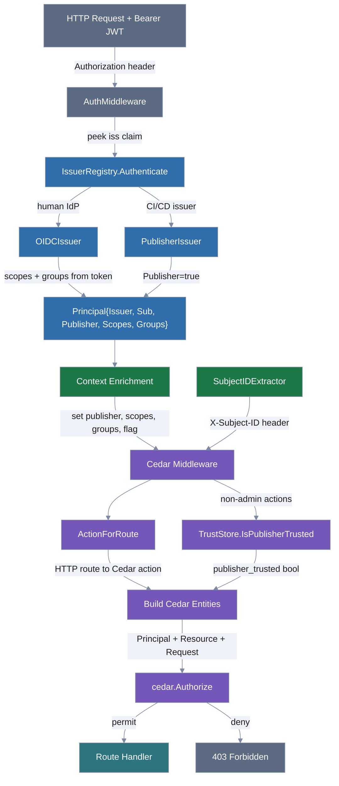
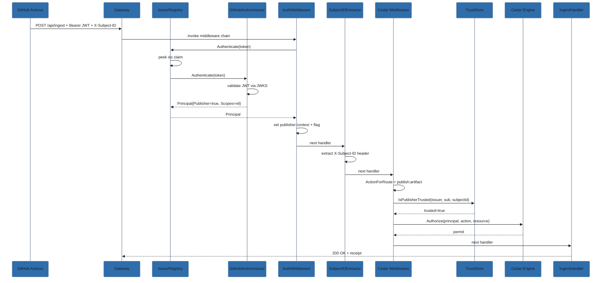
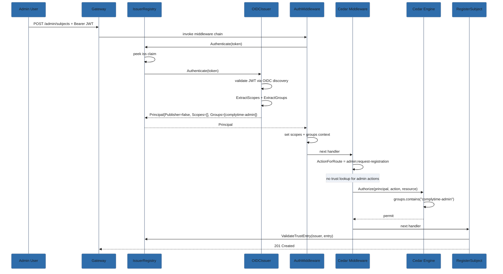

# Authorization Data Flow

How a request moves from HTTP entry through authentication, context
enrichment, and Cedar policy evaluation.

## Authorization Architecture (P\*P Pattern)

ComplyTime follows the XACML-derived P\*P authorization architecture,
with Cedar as the policy engine:

| Component | Role | Implementation |
|-----------|------|----------------|
| **PEP** (Policy Enforcement Point) | Intercepts requests, enforces allow/deny | `authz.Middleware` — returns 403 on deny |
| **PDP** (Policy Decision Point) | Evaluates policies, returns decisions | Cedar engine (`cedar.Authorize`) |
| **PIP** (Policy Information Point) | Provides attributes for decisions | Multiple sources (see below) |
| **PAP** (Policy Administration Point) | Manages policies | Embedded `base.cedar` + operator overlay via `CEDAR_POLICY_DIR` |

### Policy Information Points

The PDP receives all attributes via the Cedar `EntityMap` — there is no
runtime attribute fetch during evaluation. The PEP assembles entities
from multiple PIPs before calling `Authorize`:

| PIP | Attributes | Source |
|-----|------------|--------|
| **OIDC token** (Keycloak/Dex) | `groups`, `scopes`, `issuer`, `sub` | JWT claims, validated via JWKS |
| **Issuer registry** | `publisher` (bool) | Issuer class dispatch — true for CI/CD issuers, false for human IdP |
| **Trust store** | `publisher_trusted` (bool) | NATS KV per-subject trust registration |
| **HTTP request** | action | Route mapping (`ActionForRoute`) |

This follows the standard XACML P*P separation: the PDP never fetches
attributes at evaluation time, and each PIP is independently replaceable
(swap Keycloak for another OIDC provider, swap NATS KV for another trust
store) without changing policies.

## Overview

## Color key

| Color | Meaning |
|-------|---------|
| Slate (entry/exit) | HTTP boundary — request in, response out |
| Sapphire (authn) | Authentication — JWT validation, issuer dispatch, Principal construction |
| Emerald (context) | Context enrichment — storing identity data for downstream use |
| Amethyst (authz) | Authorization — Cedar action mapping, trust lookup, policy evaluation |
| Teal (handler) | Authorized handler execution |

## Authentication paths

Two issuer classes, routed by the `iss` claim in the JWT:

**Human IdP (OIDCIssuer)** — a Dex or Keycloak instance configured via
`OIDC_ISSUER`. Tokens carry OAuth2 scopes and/or IdP group claims.
`ExtractScopes` filters scopes to the `complytime:` namespace; `ExtractGroups`
normalizes to lowercase and filters to the `knownGroups` allowlist
(`complytime-admin`, `complytime-auditor`). Cedar policies accept either.
`Publisher` is false.

**CI/CD Publisher (PublisherIssuer)** — GitHub Actions, GitLab CI, GCP
Workload Identity, Kubernetes service accounts (EKS/GKE/AKS), SPIFFE, or
runtime-registered static JWK scanners.
`Publisher` is true; scopes are nil (publishers don't carry OAuth2 scopes).

## Cedar policy evaluation

The middleware builds three inputs for `cedar.Authorize`:

| Input | Source |
|-------|--------|
| **Principal** | `Publisher::"issuer::sub"` from JWT claims |
| **Action** | Mapped from HTTP method + route pattern |
| **Resource** | `Subject::subjectId` from `X-Subject-ID` header or `*` placeholder |

Entity attributes on Principal: `publisher` (bool), `scopes` (Set of
String), `groups` (Set of String), `issuer`, `sub`. On Resource:
`publisher_trusted` (bool from TrustStore).

## Policy decisions

| Action | Gate |
|--------|------|
| `publish:artifact` | `publisher == true` AND `publisher_trusted == true` |
| `admin:request-registration` | scopes contains `complytime:admin` OR groups contains `complytime-admin` |
| `admin:request-trust-modification` | scopes contains `complytime:admin` OR groups contains `complytime-admin` |
| `query:evidence` | scopes contains `complytime:audit`/`complytime:admin` OR groups contains `complytime-auditor`/`complytime-admin` |
| `read:evidence` | scopes contains `complytime:audit`/`complytime:admin` OR groups contains `complytime-auditor`/`complytime-admin` |

A `forbid` safety floor blocks `publish:artifact` if `publisher_trusted`
is false, regardless of other permits. Publisher access is never granted
via groups — it requires a CI/CD issuer class token.

## Sequence: publish artifact (CI/CD)

## Sequence: admin registers subject (human)

